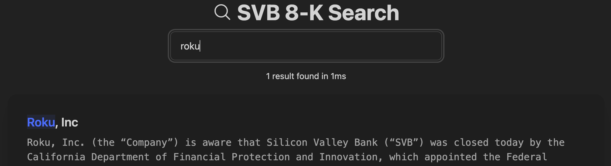

# SVB 8-K Search

Monorepo for my [svb8k.com](https://svb8k.com) project, where I have aggregated 8-K excerpts from US-based publicly traded companies which mention Silicon Valley Bank. This makes it easier to see which public companies are potentially affected by the [fallout](https://www.npr.org/2023/03/10/1162599556/silicon-valley-bank-collapse-failure-fdic-regulators-run-on-bank) of the bank.

Each part of the project contains a README which has details on installation/configuration. 

## Repo Structure
* Public
    * **API**: Express API to serve the user interface and provide an API to send contact requests or other requirements.
    * **User Interface**: Angular frontend powered by [Algolia InstantSearch](https://www.algolia.com/doc/guides/building-search-ui/what-is-instantsearch/angular/). Allows Users to search through the records available, see some FAQs, or send a contact request if desired.
* Parser
    * SEC EDGAR parsing script which gets the latest 8-K reports, detects if they mention SVB, and then saves it into a MongoDB database for later processing.
* Backend
    * **API**: Express API to handle interacting with the data and Algolia
    * **User Interface**: Angular frontend used in conjunction with the API to process reports and create the Algolia records

## Contributions
Feel free to submit a pull request with changes! This was just a quick project I did over the weekend so I'm sure there are many improvements that could be made. 
